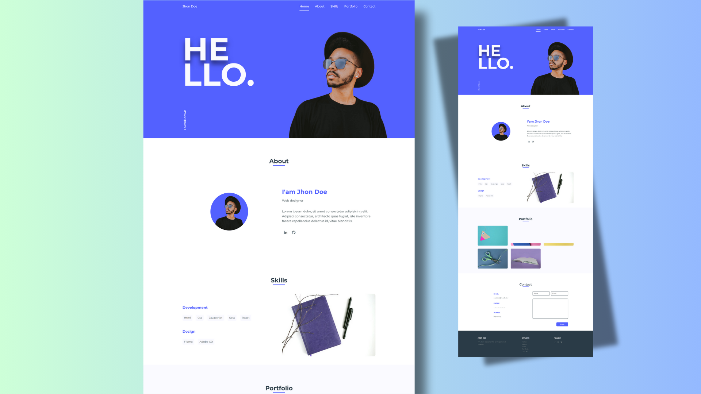

# Responsive Portfolio — Jhon Doe

A clean, modern, and fully responsive personal portfolio template built with plain HTML, CSS (SASS source included) and a touch of JavaScript.

[](preview.png)

## Overview

This repository contains a ready-to-use portfolio website that is easy to customize and deploy. It was created to showcase projects, skills, and contact information in a polished, responsive layout suitable for any device.

## Features

- Fully responsive layout (mobile-first)
- Clean, modern design
- SASS source available at `assets/sass/styles.scss`
- Lightweight vanilla JavaScript (`assets/js/main.js`)
- Simple structure for easy customization (images in `assets/img`)

## Tech stack

- HTML5
- CSS3 (+ SASS)
- JavaScript (vanilla)

## Quick start

1. Clone or download the repository.
2. Open `index.html` in your browser to view the site.

If you prefer to run a local static server (useful for testing relative paths), you can use Python's built-in server. From the project root run (PowerShell):

```powershell
python -m http.server 8000
# then open http://localhost:8000 in your browser
```

## Customization

- Replace images in `assets/img/` to personalize the portfolio (the preview uses `preview.png`).
- Edit `index.html` to change content, sections, and links.
- Update styles in `assets/css/styles.css` or modify the SASS source at `assets/sass/styles.scss` and recompile.

## Folder structure

- `index.html` — main page
- `assets/css/` — compiled CSS
- `assets/sass/` — SASS source files
- `assets/js/` — JavaScript
- `assets/img/` — images used in the site

## License & credits

Feel free to use and adapt this template. If you'd like a formal license, add a `LICENSE` file (for example, MIT).

Author: masifislamm

